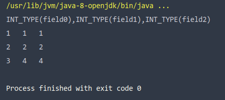

# ACM-DB Lab1

This is the answer document for lab1.

## Design Choices

1. Exercise 1:

   * TupleDesc.java:

   * Tuple.java

     ArrayList to maintain `fieldType`s and `fieldName`s

2. Exercise 2:

   * Catalog.java

     Similar to TDItem in Tuple.java, a helper class `CatalogItem` to  aggregate the information for a table.

     Two HashMap for quick table indexing.

3. Exercise 3:

   * BufferPool.java

     A HashMap for quick Page indexing.

4. Exercise 4:

   * HeapPageId.java

     `str(tableid) + str(pgNo)` as hashcode.

   * RecordID.java

     `str(pid.hashcode())+str(tupleno)` as hashcode.

   * HeapPage.java

     `PageIterator` implements `Iterator<Tuple>` as the iterator for heappage.

5. Exercise 5:

   * HeapFile.java

     `f.getAbsoluteFile().hascode()` as the unique id for heapfile.

      `HeapFileIterator` implements `DbFileIterator` as the iterator for heapfile.

6. Exercise 6:

   * SeqScan.java

     A `DbFileIterater` object to iterate through the table.

   * test.java result

## Changes to API

None.

## Missing or Incomplete elements

I believe None.

## Time Spent

1 week. Nothing special to report.

